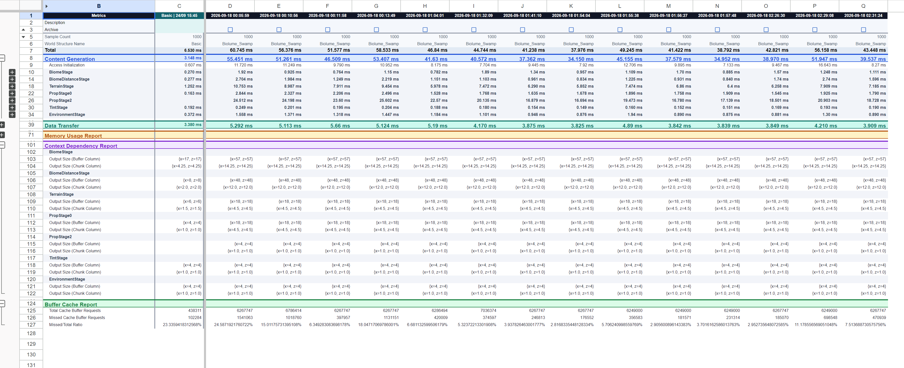

# Hytale Benchmark Tracker

Collect Hytale performance reports from local log files and publish complete
benchmark history, per-world analyses, and archive controls to Google Sheets.

<p align="center">
  
</p>

## Quick start

Requirements: Python 3.10 or later, a Google account, and local Hytale logs.

1. Download or clone the repository.
2. Run the installer for your operating system.
3. Create a Google service account and share a blank spreadsheet with it.
4. Complete the local `config.json` file.
5. Start the tracker with `python log_to_sheets.py`.

For the complete Google Cloud and configuration procedure, follow the
[setup guide](docs/SETUP.md).

> **Security:** Never commit or share `config.json` or your service account JSON
> key. Only the Google Sheets API is required. Do not grant the service account
> a Google Cloud Owner or Editor role.

## Install

### Windows

```powershell
powershell -ExecutionPolicy Bypass -File .\setup.ps1
```

### Linux or macOS

```bash
sh setup.sh
```

The installer creates `.venv`, installs the project, and creates `config.json`
from `config.example.json` if it does not already exist. Existing configuration
is never overwritten.

## Minimum configuration

Set at least these values in `config.json`:

```json
{
  "service_account_json": "C:/path/to/service-account.json",
  "spreadsheet_id": "your-google-spreadsheet-id"
}
```

Keep the other settings from `config.example.json`. The spreadsheet ID may be
provided either by itself or as a complete Google Sheets URL.

On Windows, leaving `log_folder_override` empty automatically uses the default
directory for the selected safe `log_profile`:

```text
hytale_prerelease -> %APPDATA%\Hytale\data\pre-release\Logs
hytale_release    -> %APPDATA%\Hytale\UserData\Logs
```

Set `log_folder_override` only when the logs are stored somewhere else. Linux
and macOS users must provide their local Hytale log directory explicitly.

## Run

```bash
python log_to_sheets.py
```

Alternative entry points:

```bash
python -m hytale_benchmark_tracker
hytale-benchmark-tracker
```

The tracker creates and maintains:

- `Benchmark History`: the complete permanent data for every benchmark;
- one analysis sheet for each `WorldStructure Name`;
- `Benchmark Archive`: an index of benchmarks hidden from analysis;
- `Config`: shared, non-sensitive runtime controls.

Use `Test Mode` to mark new benchmarks as tests. Use the `Archive` checkbox to
hide a benchmark from analysis without deleting it from `Benchmark History`.

Run at least one benchmark with `WorldStructure Name` set to `Basic`. The
latest non-archived `Basic` benchmark becomes the fixed reference in column C
of every analysis sheet. It stays visible while scrolling, is excluded from
the time filter, and is replaced automatically by a newer active `Basic` run.
All `Basic` runs remain in `Benchmark History`. If `world_structures` is
restricted, include `Basic` in that list.

## Documentation

- [Complete setup and configuration](docs/SETUP.md)
- [Troubleshooting](docs/TROUBLESHOOTING.md)

## Project structure

`log_to_sheets.py` is the backward-compatible entry point. Application code is
split into modules under `hytale_benchmark_tracker/` for configuration, parsing,
Google API access, history, analysis, archiving, and log watching.
